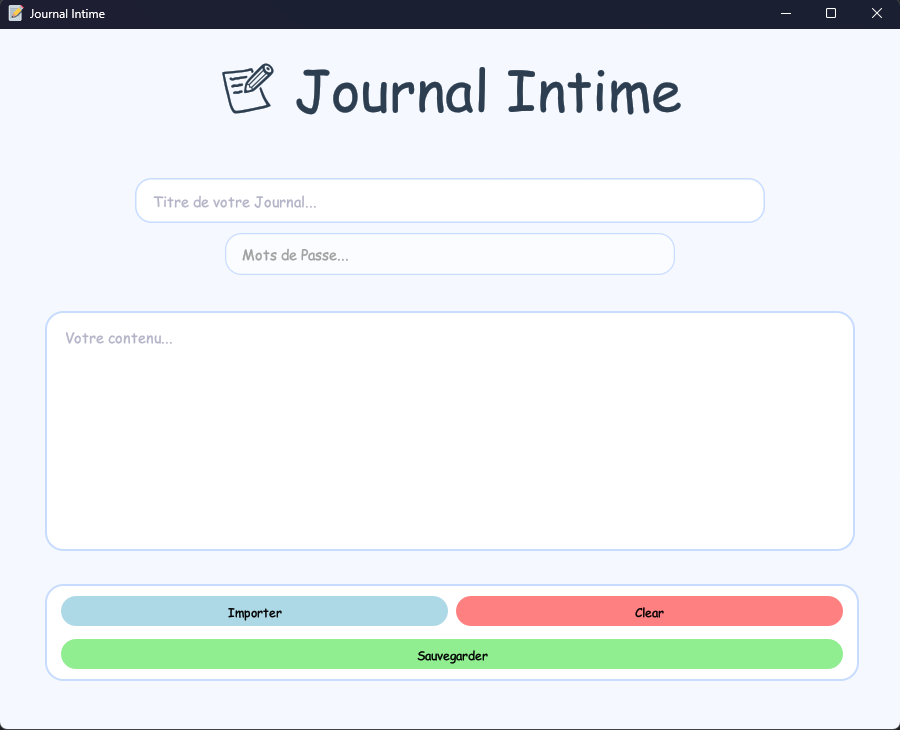

# JournalIntime-bin
Application de Journal Intime fait en Rust avec system de chiffrement et Sauvegarde des Donnée 

# Journal Intime – Binaire

> ⚠️ Ce dépôt contient uniquement le binaire compilé de **Journal Intime**.
> Le code source reste privé pour des raisons de sécurité.

**Journal Intime** est une application Rust permettant de gérer vos journaux personnels de manière sécurisée.
Elle utilise une interface graphique basée sur `eframe` et `egui`, et intègre un système de chiffrement AES-256 pour protéger vos données sensibles.

---

## Fonctionnalités principales

* **Chiffrement sécurisé** : AES-256 pour protéger les titres et contenus des journaux.
* **Gestion des journaux** : Créez, importez, sauvegardez et supprimez vos journaux.
* **Base de données SQLite** : Stockage local sécurisé.
* **Interface utilisateur moderne** : Conçue avec `egui` pour une expérience fluide.
* **Support multi-plateforme** : Windows, Linux et macOS.

---

## Installation / Utilisation

1. Téléchargez la dernière version du binaire depuis la [Release](https://github.com/Trouve-Me/JournalIntime-bin/releases).
2. Décompressez le fichier si nécessaire.
3. Lancez le binaire :

   * **Windows** : double-cliquez sur `JournalIntime.exe`
   * **Linux / macOS** : ouvrez un terminal et lancez `./JournalIntime`

---

## Vérification d’intégrité (optionnelle)

Pour garantir que le binaire n’a pas été modifié, vous pouvez vérifier son hash SHA256 :

| Nom du Fichier | Sha256|
|------------------------|-----------|
|Journal_Intime_linux | 62f4cf1d956b365dbe6efe5d60cee8a073a56cdd4b3da8131cb6f867bc196e72|
|Journal_Intime_macos| 4b3130c7782146aac33d949ba5f77f5deb6d684f91928bb48fb9b7a12b97b901|
|Journal_Intime_windows.exe| b38f8868ffb932cc05bdc4cc6a5842ec338512509852ef531efef4d32544bc14|

---

## Licence

MIT – usage du binaire autorisé selon les termes de la licence.

---
